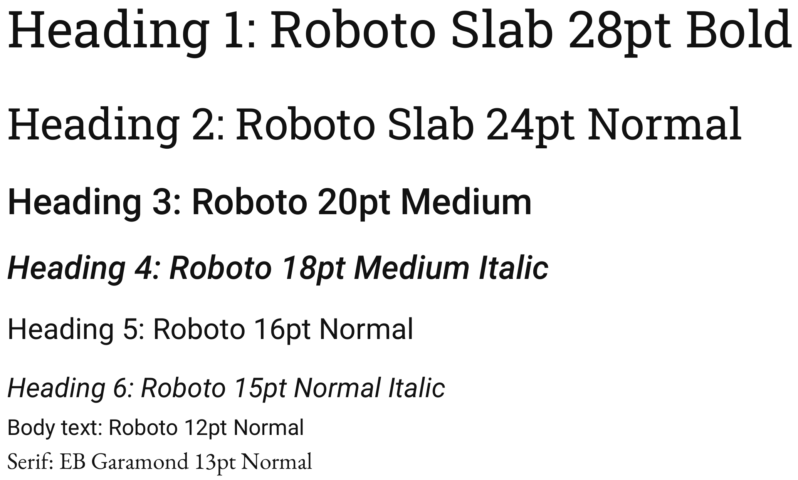
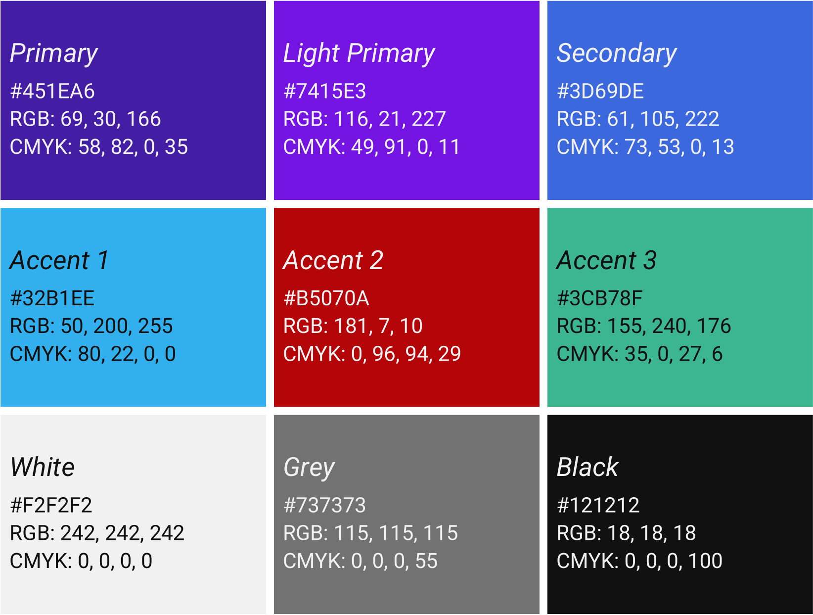
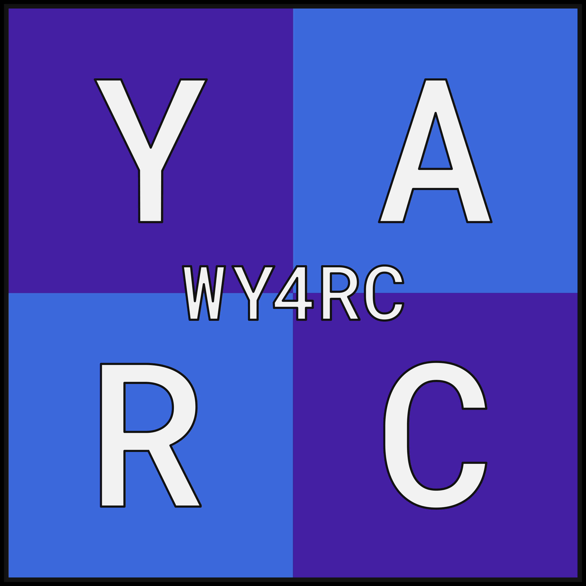
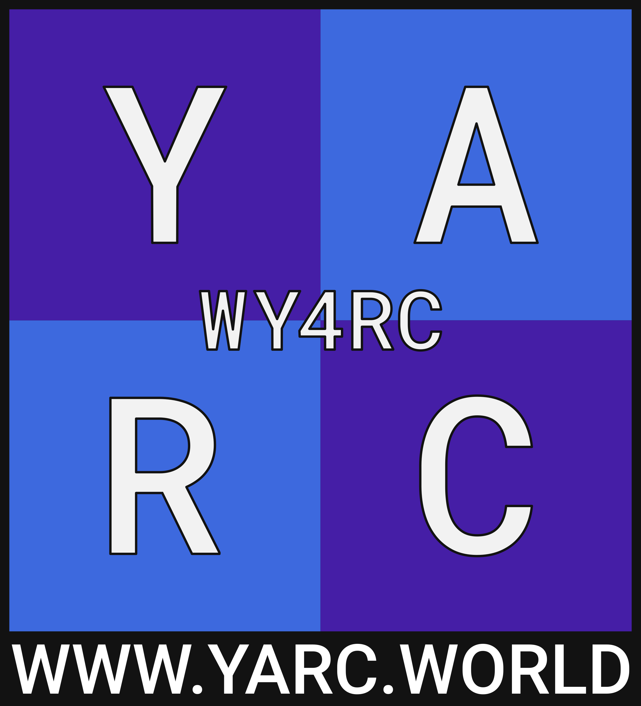
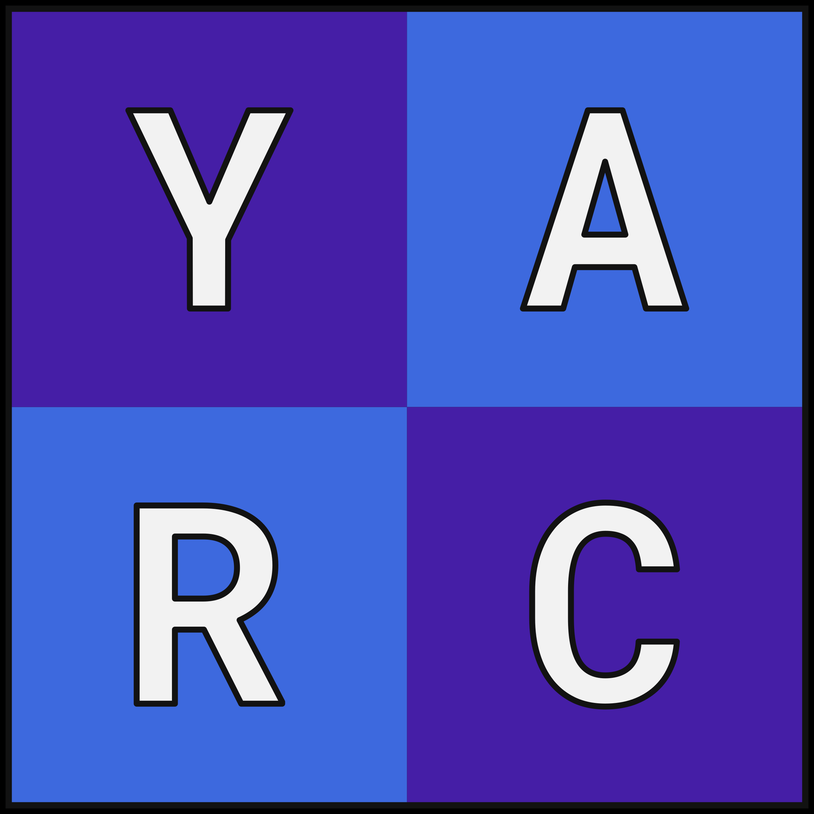
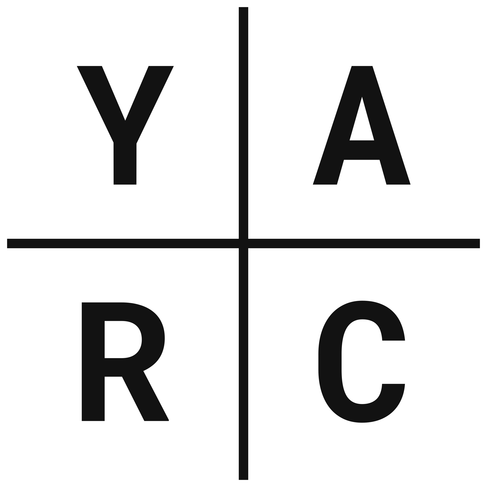
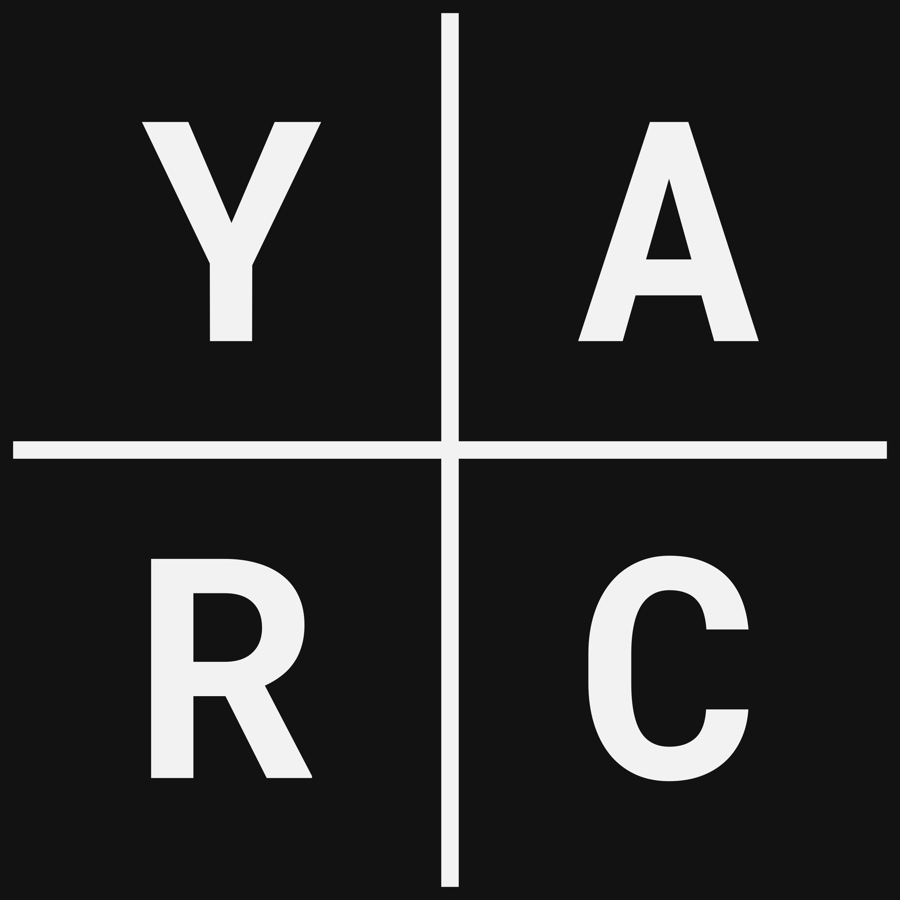

# YARC Branding

## Typography

## Colours

Use these colours whenever possible.

## Logos

YARC members are free to use the YARC logos under the [Creative Commons Attribution-NoDerivatives 4.0 License](https://creativecommons.org/licenses/by-nd/4.0/). This means you can use the files without modifications.

### Large

Use this when the "WY4RC" is large enough to be easily read.

### Promotional

The large logo can also include the YARC website URL.

### Small

Use this when the "WY4RC" in the large logo is not large enough to be easily read.

### Monochrome

Use this in simple and monochrome contexts (e.g. print). It should *only* be used in the official black and white colours digitally. In print, use full black and full white. Versions with and without
the background colour are available.

