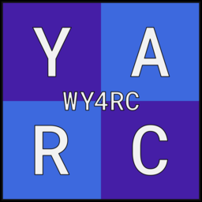
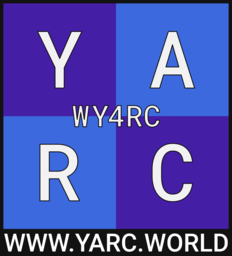
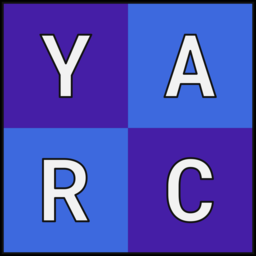
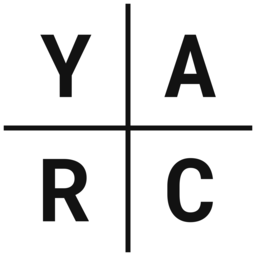
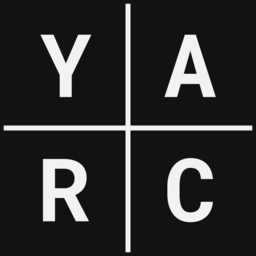

# YARC Branding

## Typography

## Colours

Use these colours whenever possible.

<table id="colours">
    <tr>
        <td style="background: url(img/colours/primary.png); color: #f2f2f2;">
            <h5>Primary</h5>
            #451EA6  
            rgb(69, 30, 166)  
            cmyk(58, 82, 0, 35)
        </td>
        <td style="background: url(img/colours/lightprimary.png); color: #f2f2f2;">
            <h5>Light Primary</h5>
            #7415E3  
            rgb(116, 21, 227)  
            cmyk(49, 91, 0, 11)
        </td>
        <td style="background: url(img/colours/secondary.png); color: #f2f2f2;">
            <h5>Secondary</h5>
            #3D69DE  
            rgb(61, 105, 222)  
            cmyk(73, 53, 0, 13)
        </td>
    </tr>
    <tr>
        <td style="background: url(img/colours/accent1.png); color: #121212;">
            <h5>Accent 1</h5>
            #32B1EE  
            rgb(50, 200, 255)  
            cmyk(80, 22, 0, 0)
        </td>
        <td style="background: url(img/colours/accent2.png); color: #f2f2f2;">
            <h5>Accent 2</h5>
            #B5070A  
            rgb(181, 7, 10)  
            cmyk(0, 96, 94, 29)
        </td>
        <td style="background: url(img/colours/accent3.png); color: #121212;">
            <h5>Accent 3</h5>
            #3CB78F  
            rgb(155, 240, 176)  
            cmyk(35, 0, 27, 6)
        </td>
    </tr>
    <tr>
        <td style="background: url(img/colours/white.png); color: #121212;">
            <h5>White</h5>
            #F2F2F2  
            rgb(242, 242, 242)  
            cmyk(0, 0, 0, 0)
        </td>
        <td style="background: url(img/colours/grey.png); color: #f2f2f2;">
            <h5>Grey</h5>
            #737373  
            rgb(115, 115, 115)  
            cmyk(0, 0, 0, 55)
        </td>
        <td style="background: url(img/colours/black.png); color: #f2f2f2;">
            <h5>Black</h5>
            #121212  
            rgb(18, 18, 18)  
            cmyk(0, 0, 0, 100)
        </td>
    </tr>
</table>

## Logos

YARC members are free to use the YARC logos under the [Creative Commons Attribution-NoDerivatives 4.0 License](https://creativecommons.org/licenses/by-nd/4.0/). This means you can use the files without modifications.

### Large

Use this when the "WY4RC" is large enough to be easily read.

#### Download
* [SVG](svg/yarc-logo.svg)
* [PNG](png/yarc-logo.png)

### Promotional

The large logo can also include the YARC website URL.

#### Download
* [SVG](svg/yarc-logo-promo.svg)
* [PNG](png/yarc-logo-promo.png)

### Small

Use this when the "WY4RC" in the large logo is not large enough to be easily read.

#### Download
* [SVG](svg/yarc-logo-small.svg) 
* [PNG](png/yarc-logo-sm.png)

### Monochrome

Use this in simple and monochrome contexts (e.g. print). It should *only* be used in the official black and white colours digitally. In print, use full black and full white. Versions with and without
the background colour are available.

#### Download
* [SVG](svg/yarc-logo-bw.svg)
* [PNG (black on white)](png/yarc-logo-bw.png)
* [PNG (black on transparent)](png/yarc-logo-b-nobg.png)
* [PNG (white on black)](png/yarc-logo-wb.png)
* [PNG (white on transparent)](png/yarc-logo-w-nobg.png)

<table>
    <tr>
        <td>
            
        </td>
        <td>
            
        </td>
    </tr>
</table>
